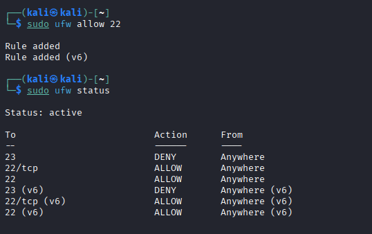
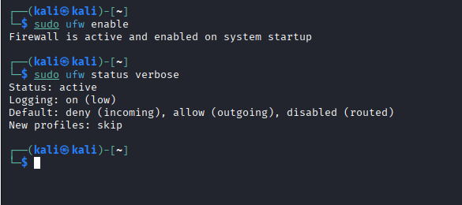
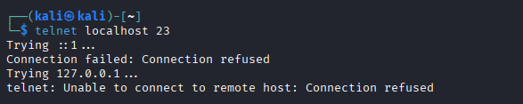

# Firewall-Setup

## Task 4 - Setup and Use a Firewall using UFW on Kali Linux

This project demonstrates how to configure a firewall using **UFW (Uncomplicated Firewall)** on Kali Linux.

### 🎯 Objective
- Block Telnet (Port 23)
- Allow SSH (Port 22)
- Verify firewall status
- Test blocked connection

---

## 🔹 Step 1: Enable UFW

```bash
sudo ufw enable
```

---

## 🔹 Step 2: Allow SSH (Port 22)

```bash
sudo ufw allow 22
```

---

## 🔹 Step 3: Block Telnet (Port 23)

```bash
sudo ufw deny 23
```

---

## 🔹 Step 4: Check UFW Status

```bash
sudo ufw status
```

---

## 🔹 Step 5: Check Detailed Status

```bash
sudo ufw status verbose
```

---

## 🔹 Step 6: Test Telnet Connection (Should Fail)

```bash
telnet localhost 23
```

---

# 📸 Screenshots

## 1️⃣ UFW Status


## 2️⃣ UFW Verbose Status


## 3️⃣ Telnet Test (Blocked)


---

## ✅ Result

- SSH (Port 22) is allowed.
- Telnet (Port 23) is blocked.
- Firewall is active and running successfully.
